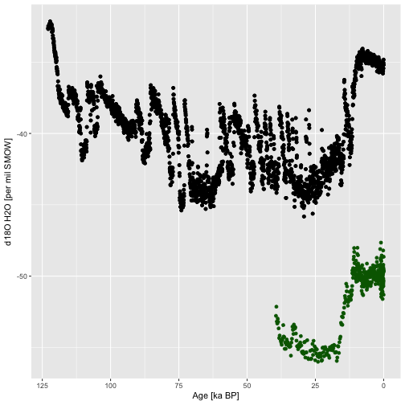

We want to analyse ice core data from two different regions of the world (and projects):

- [Arctic (NGRIP) `10.1594/PANGAEA.586886`](https://doi.pangaea.de/10.1594/PANGAEA.586886)
- [Antarctic (DomeC) `10.1594/PANGAEA.57629`](https://doi.pangaea.de/10.1594/PANGAEA.57629)

Please skim over both pages.

---

- Noticed the DOIs? Both datasets are **F**indable :-)
- Even more so, because both are annotated with geographic and event info.
- How are they licensed? Under what conditions are we allowed to use the data?
- Noticed the `Download` links over `https`? **A**ccessible data :-)


Now, will the data also be **i**nteroperable and **r**eusable on the technical level? The list of parameters in both cases show that `Age` and `d18O H2O` were measured. Sounds good, but will it blend???

---

What should be our first move towards our goal of analysing the datasets?

Of course, we need to download the datasets somehow. We could:

- `Download dataset as tab-delimited text` manually, saving the files
- write our own little download function that could for example take a vector dataset IDs (`c(586886, 57629)`) and somehow

Which one do you prefer?

Wrong ;-) There is a third option: looking for an R package related to the data repository. Search https://cran.r-project.org/web/packages/available_packages_by_name.html or https://ropensci.org/packages/ for "PANGAEA".

In case of a Python module, we might have searched [SciPy.org](https://www.scipy.org/), [PyPi.org](https://pypi.python.org/pypi), [anaconda.org](https://anaconda.org/), but in this case would not have found one.

---

Before installing your search result, ROpenSci's `pangear`, let's check that it will actually be useful for our first move. Which functions from https://ropensci.github.io/pangaear/reference/index.html sound like what we need?


```r
# install.packages("pangaear")
library(pangaear)
NGRIP <- pg_data(doi = "10.1594/PANGAEA.57629")
DomeC <- pg_data("10.1594/PANGAEA.586886")
```

Before analysing any data, we should get an overview of the R objects we created just now by the downloads:


```r
str(NGRIP)
```

```
## List of 1
##  $ :List of 6
##   ..$ parent_doi: chr "10.1594/PANGAEA.57629"
##   ..$ doi       : chr "10.1594/PANGAEA.57629"
##   ..$ citation  : chr "Lorius, C; Merlivat, Liliane; Jouzel, Jean; Pourchet, M (1979): Isotope climatic record from ice core Dome C. P"| __truncated__
##   ..$ url       : chr "https://doi.org/10.1594/PANGAEA.57629"
##   ..$ path      : chr "/Users/katrinleinweber/Library/Caches/pangaear/10_1594_PANGAEA_57629.txt"
##   ..$ data      :Classes 'tbl_df', 'tbl' and 'data.frame':	434 obs. of  9 variables:
##   .. ..$ Depth ice/snow [m]     : num [1:434] 0.445 1.39 2.41 3.43 4.45 ...
##   .. ..$ Age [ka BP]            : num [1:434] 0.003 0.01 0.019 0.03 0.041 0.053 0.065 0.076 0.088 0.1 ...
##   .. ..$ Depth top [m]          : num [1:434] 0 0.89 1.89 2.93 3.93 4.97 5.97 6.86 7.77 8.67 ...
##   .. ..$ Depth bot [m]          : num [1:434] 0.89 1.89 2.93 3.93 4.97 5.97 6.86 7.77 8.67 9.47 ...
##   .. ..$ dD [per mil SMOW]      : num [1:434] -381 -388 -389 -389 -401 ...
##   .. ..$ d18O H2O [per mil SMOW]: num [1:434] -48.6 -49.6 -49.6 -49.7 -51.3 ...
##   .. ..$ d xs [per mil]         : num [1:434] 8.45 9.2 8.2 8.02 9.3 ...
##   .. ..$ Age min [ka]           : num [1:434] 0 0.006 0.014 0.024 0.035 0.047 0.059 0.07 0.082 0.094 ...
##   .. ..$ Age max [ka]           : num [1:434] 0.006 0.014 0.024 0.035 0.047 0.059 0.07 0.082 0.094 0.106 ...
##   ..- attr(*, "class")= chr "pangaea"
```


```r
str(DomeC)
```

```
## List of 1
##  $ :List of 6
##   ..$ parent_doi: chr "10.1594/PANGAEA.586886"
##   ..$ doi       : chr "10.1594/PANGAEA.586886"
##   ..$ citation  : chr "North Greenland Ice Core Project Members (2007): 50 year means of oxygen isotope data from ice core NGRIP. PANG"| __truncated__
##   ..$ url       : chr "https://doi.org/10.1594/PANGAEA.586886"
##   ..$ path      : chr "/Users/katrinleinweber/Library/Caches/pangaear/10_1594_PANGAEA_586886.txt"
##   ..$ data      :Classes 'tbl_df', 'tbl' and 'data.frame':	4918 obs. of  2 variables:
##   .. ..$ Age [ka BP]            : num [1:4918] -0.05 0 0 0.05 0.05 0.1 0.1 0.15 0.15 0.2 ...
##   .. ..$ d18O H2O [per mil SMOW]: num [1:4918] -35.2 -35.2 -34.8 -34.8 -35 ...
##   ..- attr(*, "class")= chr "pangaea"
```

Both lists contain some metadata and the actual `data` as a `tbl_df`. What is that? [Hint: It's from the tidyverse](https://tibble.tidyverse.org/).

To verify that both variables `Age` and `d18O H2O` are really labelled in exactly the same way, we extract the variable names of both tibbles and throw out others that exist only in one tibble.


```r
DomeC <- DomeC[[1]]$data
NGRIP <- NGRIP[[1]]$data
intersect(names(DomeC), names(NGRIP))
```

```
## [1] "Age [ka BP]"             "d18O H2O [per mil SMOW]"
```

This is great! We can now plot both datasets' `d18O H2O` values against the same `Age` axis. Because the variables names contain spaces and brackets, we use the "back tick" character (\`) around both.


```r
library(ggplot2)
ggplot(data = DomeC,
       mapping = aes(x = `Age [ka BP]`, y = `d18O H2O [per mil SMOW]`)) +
  geom_point() + # inherits data & mapping from above
  geom_point(data = NGRIP, # overwrites above data, but inherits x & y
             color = "dark green") +
  scale_x_reverse() # because Age means the past
```

```
## Warning: Removed 16 rows containing missing values (geom_point).
```



Incidentally, the `Dome C` core (black, east Antarctica) captured higher `d18O` concentrations, than `NGRIP` (*Green*land).

Integrating the two datasets with this little code was possible, only because both variables were named exactly the same and thus easily machine-readable. If they hadn't been, we would have needed to:

a) either rename one between downloading and plotting, or


```r
names(NGRIP$`some other Age variable's name`) <- names(DomeC$`Age [ka BP]`)
names(NGRIP$`some other d18O variable's name`) <- names(DomeC$`d18O H2O [per mil SMOW]`)
```

b) specify in `geom_point` which second `y` should be plotted.


```r
ggplot(data = DomeC,
       mapping = aes(x = `Age [ka BP]`, y = `d18O H2O [per mil SMOW]`)) +
  geom_point() +
  geom_point(data = NGRIP,
             mapping = aes(x = `some other Age variable's name`,
                           y = `some other d18O variable's name`)
             color = "dark green")
```

So, this seemed pretty FAIR, right? Granted, **i**nteroperability encompasses a [few qualities](https://blogs.tib.eu/wp/tib/2017/09/12/the-fair-data-principles-for-research-data/#i) besides uniform variable names. However, the datasets were well **f**indable & **a**ccessible, community-standard variable naming and the CC-BY-3.0 license meant mean good **r**eusability.

This is the power of FAIR combined with nicely packaged-up R code: Reducing the burden of finding, downloading and cleaning up datasets.
