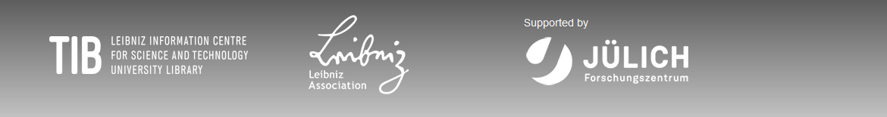

### General Information

**This workshop aimed to train junior scientists in implementing the FAIR principles for research data & software management & development.** We want to help you identify similarities and differences between these two scientific objects and apply respectively appropriate good practices in preparing, publishing and archiving your work.

<em>
  It was a new, experimental workshop format that contextualises the highly practical lesson material from the <a href="{{site.swc_site}}">Software</a> and <a href="{{site.dc_site}}">Data</a> <a href="https://carpentries.org/">Carpentries</a> with the <a href="https://blogs.tib.eu/wp/tib/2017/09/12/the-fair-data-principles-for-research-data/">FAIR principles</a>
</em>

### For whom?

Junior scientists who wish to excel at
implementing the FAIR principles for research data and scientific
software. **You need to have some previous knowledge of the tools
that will be presented at the workshop.**

### When & Where?

Please see [events.tib.eu/fair-data-software
](https://events.tib.eu/fair-data-software/)
for all the details, including public transport directions and
[accommodation suggestions](https://events.tib.eu/fair-data-software/accommodation/). You can also find us on [OpenStreetMap
](https://www.openstreetmap.org/?mlat={{page.latlng | replace:',','&mlon='}}&zoom=16)
and [add the event to your Google
Calendar](https://calendar.google.com/calendar/render?action=TEMPLATE&text=FAIR Data and Software&dates={{ page.startdate | replace: "-", "" }}/{{ page.enddate | replace: "-", "" | plus: 0}}&trp=false&sprop&sprop=name:&sf=true&output=xml&location={{ page.address }}&details="Carpentries-based workshop at the {{ page.venue }}").

### Costs

**Participation was free of charge**. However, participants needed to organise and pay for travel and [accommodation](#when--where) themselves. This workshop was part of an ideas competition supported by the [Jülich Research Centre](http://www.fz-juelich.de/portal/EN/Home/), and part of a [grant by the German Federal Ministry of Education and Research (BMBF)](https://www.bildung-forschung.digital/de/ideenwettbewerb-zum-digitalen-wandel-in-der-wissenschaft-2007.html).

### Requirements

**Please note: This workshop focussed on the application** of the FAIR Principles on scientific data and software. Because it covered a variety of examples, it did require a basic knowledge of the tools listed in [the schedule](#schedule). If you are interested in learning these basics, please consider applying for one of the (non-experimental) [Software](https://software-carpentry.org/workshops/) and [Data](http://www.datacarpentry.org/workshops-upcoming/) Carpentry workshops, or [work through](https://software-carpentry.org/lessons/) their [material](http://www.datacarpentry.org/lessons/) in a self-paced manner.

### Recordings & Workshop Material

Lecture recordings are at [av.TIB.eu/series/530](https://av.tib.eu/series/530/)
and also be hyperlinked in the schedule, along with other miscellaneous resources.
Slides are available through [TIB's NextCloud](https://tib.eu/cloud/s/tXSt3j7Bg3ySdXY).
Under [GitHub.com/TIBHannover, workshop-related repositories carry the topic `tibfds`](https://github.com/TIBHannover?q=tibfds).
On [Twitter, we used the hashtag `#TIBFDS`](https://twitter.com/search?q=%23TIBFDS).

### Contact

If you have any questions, please don't hesitate to [open an issue](https://github.com/TIBHannover/2018-07-09-FAIR-Data-and-Software/issues/).

---

<h2 id="schedule">Schedule</h2>

We approximately focussed on one topic / principle per day, introducing its reasoning,
benefits, and (differing and/or shared) implications for *proper research
data/software management/development* together with the learners. We
followed-up the theory-leaning introductions in the mornings with discussions and
live-coding sessions, using some (Software & Data) Carpentry materials to illustrate and
practice a principle's implementation in the
[STEM](https://en.wikipedia.org/wiki/Science,_technology,_engineering,_and_mathematics)
disciplines ("[MINT-Fächer](https://de.wikipedia.org/wiki/MINT-F%C3%A4cher)").
Regardless of discipline, learners were encouraged to **bring** questions about
their **own data and source code**, which we tried to answer during the week.



### Collaborative Notes

We used a <a href="{{page.collaborative_notes}}">HackMD.io pad</a> to share URLs, bits of code, and to take notes.

# Follow-up Events: [TIBHannover.GitHub.io/FAIR-studyGroup](https://tibhannover.github.io/FAIR-studyGroup/)

We'll be learning from each other and teaching ourselves further
within the context of the above topics. Anyone is welcome: be they students, personell or scientists.
